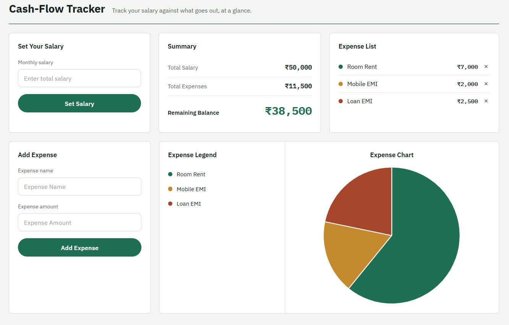

# Cash Flow Tracker

A simple, responsive, and user-friendly **Cash Flow Tracker** web application designed to help users manage income, expenses, and overall cash balance.

Built with **HTML5, CSS3, and Vanilla JavaScript**.

---

## 🔗 Live Demo

👉 **[Cash Flow Tracker — Live Website](https://logic-data-your-next-deliverable.vercel.app/)**

---

## 📸 Screenshot

*Add your project screenshot here.*

```text

```

---

## 🚀 Features

### 💰 Income Management

* Add income transactions
* Record income amount and details
* Track total income

### 💸 Expense Management

* Add expense transactions
* Record expense amount and details
* Track total expenses

### 📊 Cash Flow Dashboard

* View total income
* View total expenses
* View current balance
* Monitor cash-flow activity

### 🎨 User Interface

* Clean and modern design
* Responsive layout
* Easy-to-use forms
* Desktop and mobile friendly

---

## 🛠️ Tech Stack

| Technology         | Usage                              |
| ------------------ | ---------------------------------- |
| HTML5              | Application structure              |
| CSS3               | Styling and responsive design      |
| Vanilla JavaScript | Application logic and interactions |
| Git                | Version control                    |
| GitHub             | Source code hosting                |
| Vercel             | Production deployment              |

> No frontend framework or UI library was used. The project is built using raw HTML, CSS, and Vanilla JavaScript.

---

## 📁 Project Structure

```text
Logic_Data_Your_Next_Deliverable/
│
├── index.html        # Main application page
├── style.css         # Application styling
├── script.js         # Cash-flow logic and interactions
├── README.md         # Project documentation
└── screenshot.png    # Project screenshot
```

---

## ⚙️ How to Run Locally

### 1. Clone the repository

```bash
git clone https://github.com/35Loveislife20/Logic_Data_Your_Next_Deliverable.git
```

### 2. Open the project

```bash
cd Logic_Data_Your_Next_Deliverable
```

### 3. Run the application

Open `index.html` directly in your browser.

You can also use the **Live Server** extension in VS Code.

---

## 🌐 Deployment

The Cash Flow Tracker is deployed on **Vercel** and connected to the GitHub repository.

### Deployment Flow

```text
Local Project
     ↓
Git
     ↓
GitHub
     ↓
Vercel
     ↓
Production
```

### Production URL

👉 **https://logic-data-your-next-deliverable.vercel.app/**

The project is connected to the `main` branch, so new changes pushed to `main` can trigger a new production deployment.

---

## 🔄 Update the Live Website

After making changes to the project:

```bash
git add .
git commit -m "Update Cash Flow Tracker"
git push
```

Vercel will automatically deploy the latest version from the connected `main` branch.

---

## 🎯 Project Objective

The objective of this project is to build a simple financial tracking application that allows users to monitor their cash flow by recording income and expenses.

The application helps users understand:

* Total income
* Total expenses
* Available balance
* Overall cash-flow activity

---

## 📚 Learning Outcomes

This project helped practice:

* HTML5 page structure
* CSS3 styling
* Responsive web design
* JavaScript DOM manipulation
* Event handling
* Form handling
* Dynamic calculations
* User interaction
* Git and GitHub
* Vercel deployment

---

## 🤖 AI Usage

AI assistance was used during development for:

* Understanding coding approaches
* Debugging
* Improving JavaScript logic
* UI/UX improvements
* Documentation preparation

All final project implementation and decisions were reviewed before submission.

---

## 👤 Author

**Satish Kumar**

Prodesk IT Project Submission — 2026

---

## 📄 License

This project is created for educational and project-submission purposes.

---

*© 2026 Cash Flow Tracker. All rights reserved.*
